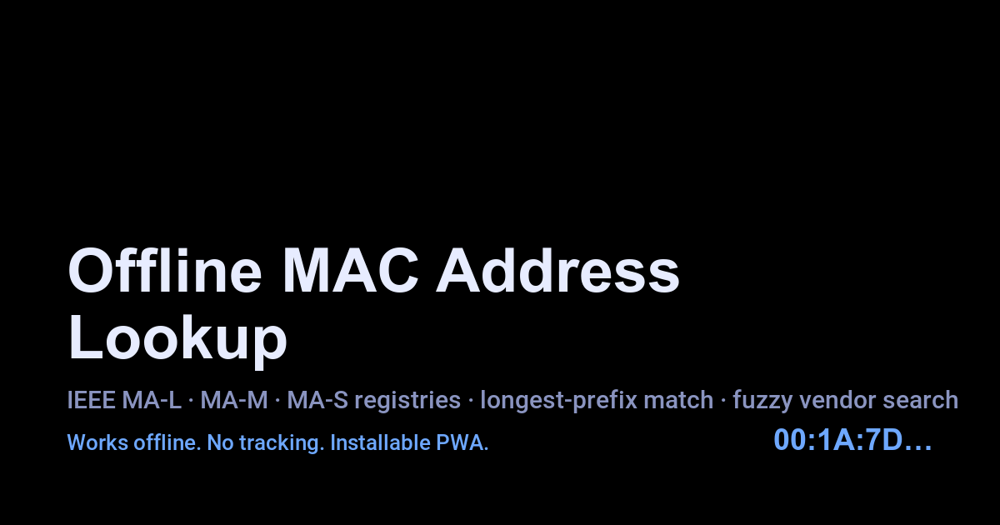

# maclookup.py

[](https://stewalexander-com.github.io/maclookup.py/)

**🌐 Try it live: [stewalexander-com.github.io/maclookup.py](https://stewalexander-com.github.io/maclookup.py/)** — installable PWA, works fully offline.

Look up a MAC address's manufacturer in any format without an internet
connection, across **all three** IEEE assignment registries.

## Description

`maclookup.py` is a Python script that resolves the manufacturer of a network
device from its MAC address. It works fully offline using locally bundled IEEE
CSVs and now covers the entire allocation hierarchy:

| Registry | Block size | File          |
| -------- | ---------- | ------------- |
| MA-L     | 24-bit     | `oui.csv`     |
| MA-M     | 28-bit     | `mam.csv`     |
| MA-S     | 36-bit     | `oui36.csv`   |

A query is matched **longest prefix first** (MA-S → MA-M → MA-L), so a
9-hex-character MA-S assignment will win over a coincidental 24-bit MA-L hit.

A static PWA front-end in [`web/`](web/) provides the same lookup, plus
client-side fuzzy vendor search, deployable to GitHub Pages.

## Features

- Three IEEE registries (MA-L / MA-M / MA-S), longest-prefix matching.
- Supports MAC formats: `00:1A:7D`, `00-1A-7D`, `0000.0C12`, `001A7D`.
- Works completely offline.
- Clean ASCII-formatted CLI output with the matched registry tag.
- Interactive command-line interface.
- Static, installable PWA with offline cache and manual data refresh.

## Requirements

- Python 3.x
- The bundled CSV files (`oui.csv`, `mam.csv`, `oui36.csv`) in the same
  directory as the script.

## Installation

1. Clone this repository or download the script plus the three CSVs.
2. Make the script executable (Unix-like systems):
   ```bash
   chmod +x maclookup.py
   ```

## Usage

```bash
./maclookup.py
# or
python3 maclookup.py
```

**iPhone**: copy `maclookup.py` and the three CSVs to iCloud for use with the
Pythonista app.

When prompted, enter a MAC address in any supported format. The matched
registry (MA-L/MA-M/MA-S), assignment prefix, organization, and address are
printed. Type `q` or `quit` to exit.

### Programmatic use

```python
from maclookup import lookup
record = lookup("8C:1F:64:AF:A0:00")
# VendorRecord(registry='MA-S', assignment='8C1F64AFA',
#              organization='DATA ELECTRONIC DEVICES, INC',
#              address='32 NORTHWESTERN DR SALEM NH US 03079 ')
```

The legacy `search_oui(csv_file, mac)` API is preserved and still returns
`(name, address)` so existing imports continue to work.

## CSV file format

All three CSVs share the IEEE schema:

| Column | Field               |
| ------ | ------------------- |
| 1      | Registry (`MA-L`, `MA-M`, or `MA-S`) |
| 2      | Assignment (6/7/9 hex chars) |
| 3      | Organization Name   |
| 4      | Organization Address |

## Keeping the registries up to date

The CSVs mirror the authoritative IEEE registries:

* `oui.csv` &nbsp;← `https://standards-oui.ieee.org/oui/oui.csv`
* `mam.csv` &nbsp;← `https://standards-oui.ieee.org/oui28/mam.csv`
* `oui36.csv` ← `https://standards-oui.ieee.org/oui36/oui36.csv`

A GitHub Actions workflow (`.github/workflows/update-oui.yml`) refreshes all
three weekly, rebuilds the PWA data bundle, runs the test suite, and opens a
PR if anything changed.

To refresh locally:

```bash
python3 scripts/update_registries.py            # refresh all three
python3 scripts/update_registries.py --check    # validate without writing
python3 scripts/update_registries.py --registry mam  # subset
python3 scripts/build_web_data.py               # rebuild web/data/registry.json
python3 -m unittest discover -s tests
```

The legacy `python3 scripts/update_oui.py` still works and refreshes just the
MA-L CSV.

The updater rejects truncated or malformed downloads (header mismatch, wrong
registry label, wrong assignment width, row count below floor, or >2% shrink
vs. the committed file).

For the automated PR workflow to function, the repo's Settings → Actions →
General must allow GitHub Actions to create pull requests. No additional
secrets are required — the default `GITHUB_TOKEN` is sufficient.

## Static PWA (`web/`)

The PWA in [`web/`](web/) is a single static folder with no build step:

* `index.html`, `app.js`, `styles.css` — the app shell.
* `sw.js` — service worker; caches the app shell and registry bundle so the
  PWA is fully usable offline.
* `manifest.webmanifest` + `icons/` — install metadata.
* `data/registry.json` — bundled MA-L/MA-M/MA-S data with a UTC version
  stamp, regenerated by `scripts/build_web_data.py` from the CSVs.

The UI does two things:

1. **Lookup** — when the input looks like hex, it normalizes separators and
   runs the same longest-prefix algorithm as the Python CLI (MA-S 9 hex →
   MA-M 7 hex → MA-L 6 hex), then shows the matched registry, assignment,
   organization, and address.
2. **Fuzzy vendor search** — when the input looks like text, it scores every
   entry with a deterministic mix of exact-substring, token, and subsequence
   matching, and returns the top 50 vendors.

### How the offline/refresh mechanism works

* On first load, the PWA fetches `data/registry.json`; the service worker
  caches it (along with the app shell) under `maclookup-data-v1`.
* The parsed structure is also written to IndexedDB so subsequent cold starts
  don't re-parse 5 MB of JSON; the data version stamp is shown in the footer.
* On later loads, the app reads from IndexedDB first (instant), then quietly
  re-fetches in the background if online (cache-first), so the UI is
  responsive whether the device is online or offline.
* The **Refresh data** button forces a `cache: 'no-store'` fetch with
  `?refresh=1`; the service worker honors that flag and updates the
  cache. If the network is unreachable, the existing cache is kept.

### GitHub Pages deployment

`.github/workflows/pages.yml` deploys `web/` to GitHub Pages on every push to
`main` that touches the app shell, the CSVs, or the build script.

**One-time maintainer setup** (cannot be done by Actions): in the GitHub
repo's **Settings → Pages**, set **Source** to **GitHub Actions**. After that
the workflow publishes automatically. No secrets are required — the default
`GITHUB_TOKEN` is sufficient. The equivalent API call is:

```bash
gh api -X POST repos/<owner>/<repo>/pages \
  -f build_type=workflow
```

## License

This project is licensed under the GNU General Public License v3.0 — see the
LICENSE file for details.

## Contributing

Contributions are welcome! Please feel free to submit a Pull Request.
